<div align="center">

# 🚨 Rakshak AI

### Intelligent Emergency Response & Resource Coordination Platform

**Turning fragmented emergency reports into coordinated, real-time action.**

<br/>


<br/>

[**Overview**](#-at-a-glance) ·
[**Features**](#-key-features) ·
[**How it works**](#-how-it-works) ·
[**Architecture**](#-system-architecture) ·
[**AI & engines**](#-intelligence-engines) ·
[**Run it**](#-quick-start) ·
[**Demo script**](#-recommended-demo-flow)

</div>

---

## 🧭 At a Glance

> **Rakshak AI is a web-based emergency command platform.** It unifies citizen reports, classifies them with AI, detects duplicates, recommends the best responders, dispatches them, tracks progress live, and turns it all into analytics, end to end.

<table>
<tr>
<td width="50%" valign="top">

### ❌ The problem
Emergency information arrives from disconnected sources, so responders lose time:

- No single source of truth
- Duplicate reports of the same event
- Incorrect or delayed prioritisation
- Slow resource allocation
- Poor operator visibility
- Late escalation of life-critical incidents

</td>
<td width="50%" valign="top">

### ✅ What Rakshak AI does
One pipeline from first report to final analytics:

- **Citizens** report in seconds, with geolocation
- **AI** classifies type, severity, priority and actions
- **Scoring engine** flags duplicate reports
- **Ranking engine** recommends the best-fit responders
- **Operators** dispatch from one live command center
- **Responders** progress incidents from a mobile view
- **Cron** escalates unassigned P1 incidents automatically

</td>
</tr>
</table>

### 📊 The project in numbers

| 🧩 Core modules | 🌐 REST endpoints | ⚡ Live events | 🗄️ Collections | 🤖 AI fallback depth | 🚒 Seeded resources |
|:---:|:---:|:---:|:---:|:---:|:---:|
| **12 / 12** working | **29** | **9** Socket.IO types | **7** with `2dsphere` geo indexes | **4 models + rules** | **19** |

### 🏆 Where to look, by judging criterion

| Criterion | What to look at | Section |
|---|---|---|
| **Innovation** | Multi-signal duplicate detection, explainable ranking, AI with guaranteed fallback | [Intelligence engines](#-intelligence-engines) |
| **Technical depth** | Geospatial queries, server-enforced state machine, real-time event bus, cron escalation | [Architecture](#-system-architecture) |
| **Completeness** | Every stage from report to analytics runs on real services, not mock data | [Implementation status](#-implementation-status) |
| **User experience** | Three purpose-built views (citizen, operator, responder) with live updates | [How it works](#-how-it-works) |
| **Real-world impact** | Faster triage, fewer duplicate dispatches, guaranteed escalation | [Problem](#-at-a-glance) |
| **Reliability** | Classification never fails: AI falls back through 4 models, then rules | [AI pipeline](#1--ai-classification-pipeline) |
| **Honesty and scope** | Explicit list of limitations and roadmap | [Limitations](#-limitations) |

---

## 📑 Table of Contents

<details>
<summary><b>Click to expand</b></summary>

1. [At a Glance](#-at-a-glance)
2. [Our Solution](#-our-solution)
3. [Key Features](#-key-features)
4. [How It Works](#-how-it-works)
5. [System Architecture](#-system-architecture)
6. [Intelligence Engines](#-intelligence-engines)
7. [Tech Stack](#-tech-stack)
8. [API Reference](#-api-reference)
9. [Database Design](#-database-design)
10. [Security and Access Control](#-security-and-access-control)
11. [Project Structure](#-project-structure)
12. [Quick Start](#-quick-start)
13. [Recommended Demo Flow](#-recommended-demo-flow)
14. [What Makes It Technically Strong](#-what-makes-it-technically-strong)
15. [Implementation Status](#-implementation-status)
16. [Limitations](#-limitations)
17. [Roadmap](#-roadmap)
18. [Team and Links](#-team-and-links)

</details>

---

## 💡 Our Solution

Every incoming report travels through one unified pipeline. Each stage is implemented and demonstrable.


<div align="center">

🔵 **Intake** → 🟣 **Intelligence** → 🟠 **Action** → 🟢 **Outcome and insight**

</div>

---

## ✨ Key Features

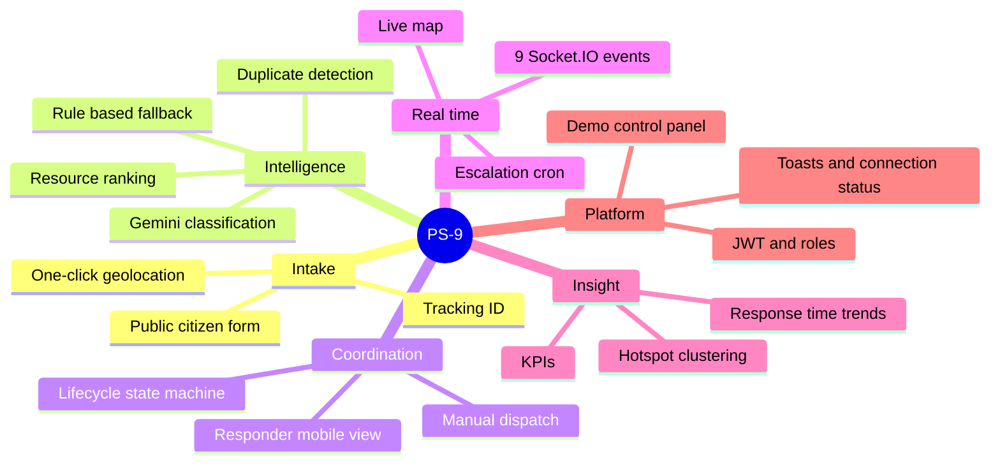

| Feature | What it does | How it works | Status |
|---|---|---|:---:|
| **Citizen Emergency Reporting** | Public form for description, geolocation, optional address | React form → `POST /api/v1/incidents` → returns tracking ID | ✅ |
| **AI Incident Classification** | Detects type, severity, priority, summary, recommended actions | Google Gemini with schema-enforced JSON output | ✅ |
| **Rule-Based Fallback** | Guarantees classification when AI is unavailable | Keyword-weighted classifier in `classification.service.js` | ✅ |
| **Duplicate Detection** | Flags reports that likely describe the same event | `$near` geo query + time window + Jaccard text similarity (40/20/40) | ✅ |
| **Operator Dashboard** | Live command center: map, incident list, resource panel, alerts | React + Leaflet + Socket.IO | ✅ |
| **Resource Recommendation** | Ranks best-fit responders for an incident | Capability 50% + availability 25% + distance 25% | ✅ |
| **Manual Dispatch** | Operator assigns a resource in one click | `POST /incidents/:id/assign` | ✅ |
| **Incident Lifecycle** | Enforced state machine from classified to closed | Server-side transition validation | ✅ |
| **Real-Time Updates** | Every client updates without a refresh | 9 Socket.IO event types | ✅ |
| **Escalation Alerts** | Auto-alerts when P1 incidents stay unassigned | `node-cron` every minute, configurable thresholds | ✅ |
| **Interactive Map** | Live incident and resource markers | Leaflet + OpenStreetMap + custom coloured markers | ✅ |
| **Analytics Dashboard** | KPIs, distributions, response-time trends, hotspots | MongoDB aggregation pipelines + Recharts | ✅ |
| **Responder View** | Mobile-friendly assignment progression | React route `/responder`, role-gated | ✅ |
| **Demo Control Panel** | One-click Market Fire simulation and reset | `POST /demo/market-fire` runs a scripted scenario | ✅ |
| **JWT Authentication** | Role-based access for 5 roles | JWT + bcrypt + role middleware | ✅ |
| **Image Upload** | Citizen photo attachments | Cloudinary integration | 🔵 Planned |
| **OSRM Routing** | Draw the dispatch path on the map | Route overlay | 🔵 Planned |
| **Multi-language AI** | Hindi, Marathi, Gujarati classification | Gemini multilingual prompts | 🔵 Planned |

### 🖥️ Command center layout (conceptual)

```text
┌──────────────────────────────────────────────────────────────────────────┐
│ 🚨 PS-9 Command Center                        🟢 Live     👤 Operator    │
├──────────────────────────────────────────────────────────────────────────┤
│  [ Active ]     [ P1 Critical ]     [ Avg Response ]     [ Available ]   │  ← KPI cards
├───────────────────────────────────────────────┬──────────────────────────┤
│                                               │  📋 Incident list        │
│                                               │  ┌────────────────────┐  │
│              🗺️  LIVE MAP                     │  │ INC-10024  🔴 P1   │  │
│        🔥 incidents   🚒 🚑 🚓 resources       │  │ Fire · Market Rd   │  │
│                                               │  └────────────────────┘  │
│                                               │  ┌────────────────────┐  │
│                                               │  │ INC-10023  🟠 P2   │  │
├───────────────────────────┬───────────────────┤  └────────────────────┘  │
│  🚒 Resource panel        │  🔔 Alert feed    │  🎬 Demo control panel   │
│  FT-01 available          │  P1 unassigned 5m │  [ Run Market Fire ]     │
└───────────────────────────┴───────────────────┴──────────────────────────┘
        Click any incident → detail drawer: AI summary · timeline · ranked resources · Dispatch
```

<!--
📸 SCREENSHOTS (uncomment after adding images to docs/screenshots/)

| Command Center | Citizen Report | Responder View |
|:---:|:---:|:---:|
|  |  |  |

| Analytics | Incident Drawer | Market Fire Demo |
|:---:|:---:|:---:|
|  |  |  |
-->

---

## 🔄 How It Works

### 1. Full lifecycle, one sequence

From a citizen's tap to a resolved incident. Every arrow into **Socket.IO** is a live broadcast.

```mermaid
sequenceDiagram
    autonumber
    actor Cit as 👤 Citizen
    participant API as ⚙️ Express API
    participant AI as 🤖 Gemini / Rules
    participant DB as 🗄️ MongoDB
    participant WS as ⚡ Socket.IO
    actor Op as 🎛️ Operator
    actor Res as 🚑 Responder

    rect rgb(30, 58, 95)
    Note over Cit,WS: Phase 1 — Report and classify
    Cit->>API: POST /incidents (description + location)
    API->>AI: classifyWithAI(description)
    AI-->>API: type, severity, priority, summary, actions
    API->>DB: find duplicates (300 m, 10 min, text similarity)
    API->>DB: save Incident + SourceReport + AnalyticsEvent
    API->>WS: emit incident:created
    API-->>Cit: tracking ID + classification
    WS-->>Op: incident appears instantly
    end

    rect rgb(74, 44, 107)
    Note over Op,WS: Phase 2 — Recommend and dispatch
    Op->>API: GET /incidents/:id/recommendations
    API-->>Op: top 3 ranked resources with ETA
    Op->>API: POST /incidents/:id/assign
    API->>DB: incident = assigned, resource = assigned
    API->>WS: emit incident:assigned + resource:updated
    WS-->>Res: new assignment
    end

    rect rgb(20, 83, 45)
    Note over Res,WS: Phase 3 — Progress and resolve
    Res->>API: POST /incidents/:id/status (en_route, on_scene, resolved)
    API->>API: validate state machine transition
    API->>DB: set milestone timestamps, release resources on resolve
    API->>WS: emit incident:updated + incident:resolved
    WS-->>Op: dashboard updates without refresh
    end
```

### 2. Three personas, one platform

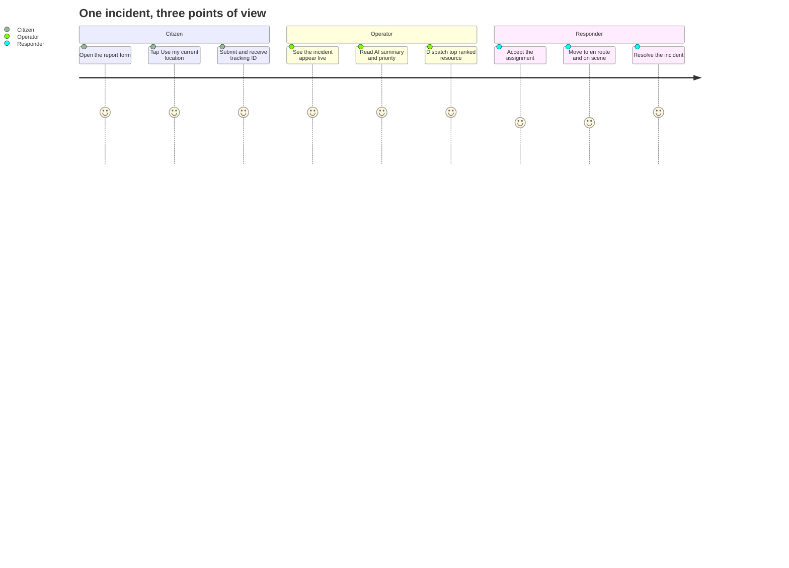

### 3. Incident lifecycle (server-enforced state machine)

Invalid transitions are rejected with HTTP 400, so an operator or client can never skip a step.

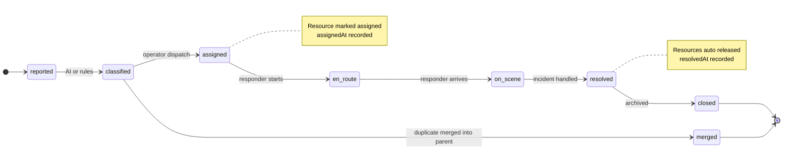

### 4. Startup sequence

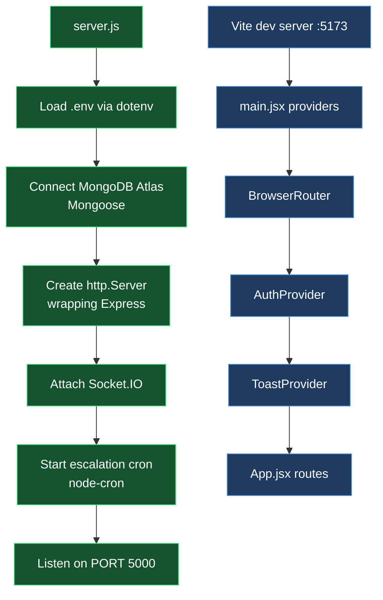

---

## 🏗️ System Architecture

### Layered overview

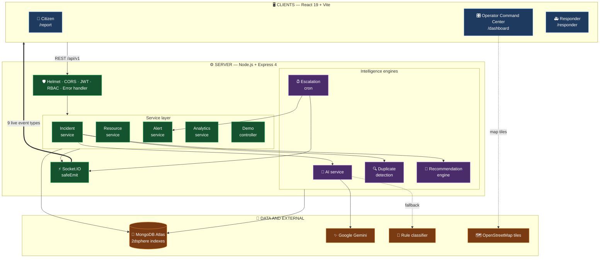

### Backend request pattern

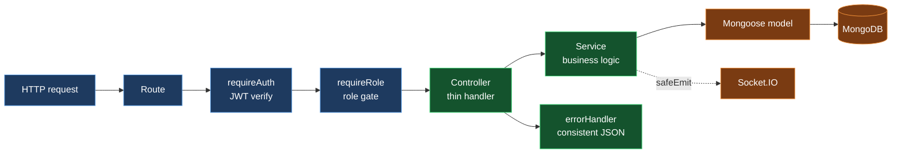

`route → controller → service → model`. Services call `safeEmit` and never import socket internals directly, so business logic stays decoupled from transport.

### ⚡ Real-time event bus

| Event | Fired when | Consumed by |
|---|---|---|
| `incident:created` | A new report is saved | Dashboard list and map |
| `incident:duplicate_candidates` | Similar existing incidents are found | Operator merge prompt |
| `incident:assigned` | A resource is dispatched | Dashboard, responder view |
| `incident:updated` | Status change or escalation level change | Dashboard, responder view |
| `incident:resolved` | Incident reaches resolved | Dashboard, analytics |
| `resource:updated` | Resource status changes | Resource panel, map |
| `alert:created` | Escalation raises an alert | Alert feed, toasts |
| `alert:acknowledged` | Operator acknowledges an alert | Alert feed |
| `demo:reset` | Demo data is wiped | All connected clients |

Clients use `useSocket` (connects once authenticated) and `useSocketEvent(name, handler)`, which subscribes and cleans up on unmount.

---

## 🧠 Intelligence Engines

Four deterministic, explainable engines sit between "report received" and "responder dispatched".

### 1. 🤖 AI classification pipeline

**Model:** Google Gemini via `@google/generative-ai`, with `responseSchema` enum constraints on type, severity and priority. **The app never fails classification.**

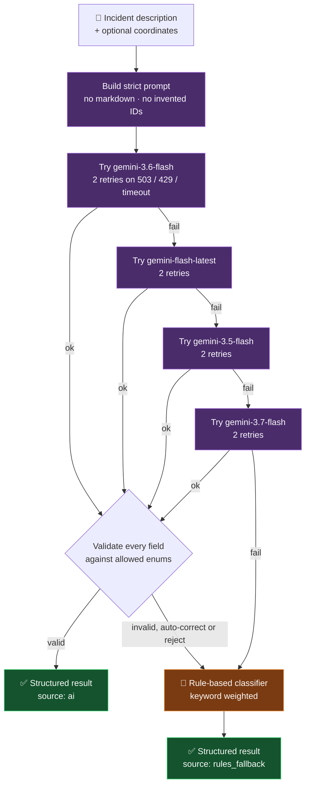

<details>
<summary><b>📤 Example AI output</b></summary>

```json
{
  "type": "fire",
  "severity": "critical",
  "priority": "P1",
  "confidence": 0.98,
  "summary": "Large fast-spreading fire near central market with trapped individuals.",
  "recommendedActions": [
    "Dispatch fire suppression units immediately",
    "Evacuate central market and surrounding area",
    "Deploy search and rescue teams",
    "Establish a secure perimeter"
  ],
  "source": "ai",
  "model": "gemini-3.6-flash",
  "elapsedMs": 3507
}
```

</details>

> **Design rule:** AI output is advisory. It is stored separately from operator actions and the system **never auto-dispatches**.

### 2. 🔍 Duplicate detection

Three signals are combined into one explainable score, with a per-candidate breakdown shown to the operator.


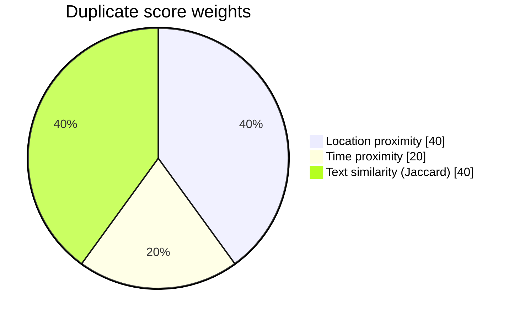

### 3. 🎯 Resource recommendation

A deterministic ranking, so every suggestion can be debugged and defended.

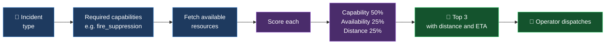

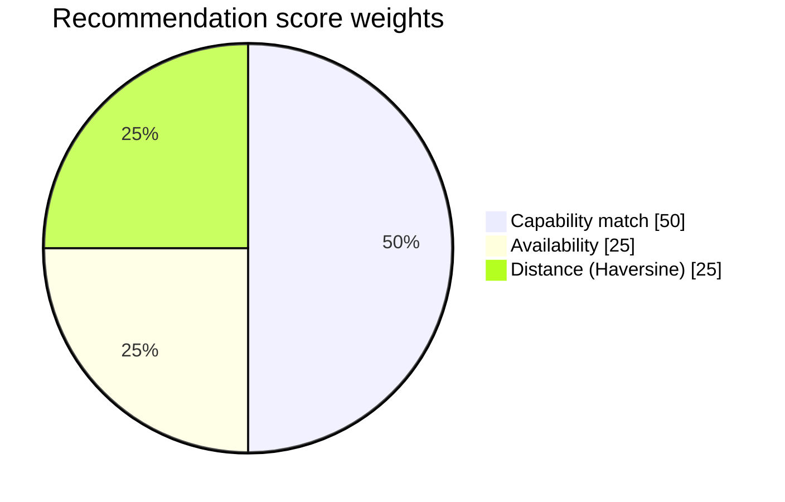

### 4. ⏰ Escalation engine

A cron job runs **every minute** and raises an alert when an incident has waited too long without a responder.

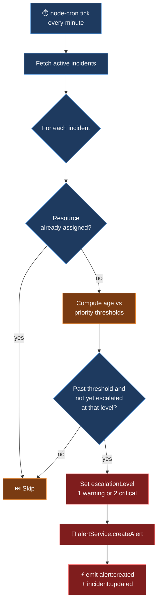

**Default thresholds** (minutes an incident may wait unassigned, configurable via `.env`):

| Priority | ⚠️ Warning (level 1) | 🔴 Critical (level 2) |
|:---:|:---:|:---:|
| **P1** | 2 | 5 |
| **P2** | 5 | 10 |
| **P3** | 15 | 30 |
| **P4** | 30 | 60 |

The engine is **idempotent**: it never fires the same level twice for the same incident.

---

## 🧰 Tech Stack

| Layer | Technology | Purpose |
|---|---|---|
| **Frontend** |   | SPA UI and dev server |
| **Routing and HTTP** | React Router v6 · Axios | Client routing, REST calls with JWT interceptor |
| **Real time (client)** | Socket.IO Client | Live updates |
| **Maps** | Leaflet · React-Leaflet · OpenStreetMap | Interactive incident and resource map (no API key) |
| **Charts and icons** | Recharts · Lucide React | Analytics and iconography |
| **Styling** | CSS3 variables + inline styles | Dark command-center theme |
| **Backend** |   | REST API |
| **Database** |  Mongoose ODM | Primary store with `2dsphere` geo support |
| **Real time (server)** | Socket.IO | WebSocket broadcasting |
| **AI** |  `@google/generative-ai` | Incident classification |
| **Auth** | `jsonwebtoken` · `bcryptjs` | Stateless auth and password hashing |
| **Scheduler** | `node-cron` | Escalation checks every minute |
| **Security** | Helmet · CORS · `express-rate-limit` | HTTP hardening |
| **Dev tooling** | Nodemon · Git · Postman / Thunder Client | Developer experience |
| **Deploy targets** | Vercel (frontend) · Render (backend) · MongoDB Atlas (DB) | Cloud-ready |

### 🔌 External integrations

| Service | Purpose | Where | Key needed |
|---|---|---|:---:|
| **Google Gemini** | Classify incident text | `server/src/services/ai.service.js` | ✅ `GEMINI_API_KEY` (server only) |
| **MongoDB Atlas** | Data and geospatial queries | `server/src/config/db.js` | ✅ `MONGODB_URI` |
| **OpenStreetMap tiles** | Map tiles | `client/src/components/map/MapView.jsx` | ❌ none |
| **Socket.IO** | Bidirectional events | client and server | ❌ none |

---

## 📡 API Reference

**Base URL:** `/api/v1` · **29 endpoints** across 6 route groups plus health

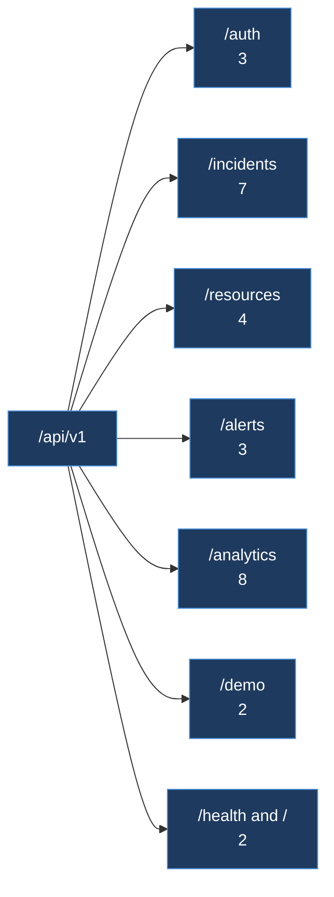

<details>
<summary><b>🔐 Authentication (3)</b></summary>

| Method | Endpoint | Purpose | Auth | Request | Response |
|---|---|---|---|---|---|
| POST | `/auth/register` | Register new user | Public | `{name, email, password, role?}` | `{token, user}` |
| POST | `/auth/login` | Log in | Public | `{email, password}` | `{token, user}` |
| GET | `/auth/me` | Current user | Bearer | none | `user` |

</details>

<details open>
<summary><b>🚨 Incidents (7)</b></summary>

| Method | Endpoint | Purpose | Auth | Roles |
|---|---|---|---|---|
| POST | `/incidents` | Citizen submits report | Public | none |
| GET | `/incidents` | List with filters (`status`, `severity`, `priority`, `type`, `active`) | Bearer | operator, admin |
| GET | `/incidents/:id` | Single incident (ObjectId or `INC-xxxxx`) | Bearer | any |
| POST | `/incidents/:id/assign` | Dispatch a resource | Bearer | operator, admin |
| POST | `/incidents/:id/status` | Transition status | Bearer | operator, admin, responder |
| POST | `/incidents/:id/merge` | Merge a duplicate into this incident | Bearer | operator, admin |
| GET | `/incidents/:id/recommendations` | Ranked resource suggestions | Bearer | any |

</details>

<details>
<summary><b>🚒 Resources (4)</b></summary>

| Method | Endpoint | Purpose | Auth | Roles |
|---|---|---|---|---|
| GET | `/resources` | List with filters | Bearer | any |
| GET | `/resources/:id` | Single resource | Bearer | any |
| PATCH | `/resources/:id/status` | Change status | Bearer | operator, admin, responder |
| POST | `/resources/seed` | Seed 19 demo resources | Bearer | admin |

</details>

<details>
<summary><b>🔔 Alerts (3)</b></summary>

| Method | Endpoint | Purpose | Auth | Roles |
|---|---|---|---|---|
| GET | `/alerts` | List alerts | Bearer | any |
| GET | `/alerts/:id` | Single alert | Bearer | any |
| PATCH | `/alerts/:id/acknowledge` | Acknowledge | Bearer | operator, admin |

</details>

<details>
<summary><b>📊 Analytics (8)</b> — operator and admin only</summary>

| Method | Endpoint | Purpose |
|---|---|---|
| GET | `/analytics/overview` | KPI summary |
| GET | `/analytics/types` | Incidents grouped by type |
| GET | `/analytics/severity` | Grouped by severity |
| GET | `/analytics/priority` | Grouped by priority |
| GET | `/analytics/response-time?days=7` | Daily average response time |
| GET | `/analytics/resources` | Utilisation stats |
| GET | `/analytics/hotspots` | Geographic clustering (rounded grid coordinates) |
| GET | `/analytics/events?limit=50` | Recent event log |

</details>

<details>
<summary><b>🎬 Demo (2) and ❤️ Health (2)</b></summary>

| Method | Endpoint | Purpose | Auth | Roles |
|---|---|---|---|---|
| POST | `/demo/reset` | Wipe incidents, alerts and events; release resources | Bearer | admin, operator |
| POST | `/demo/market-fire` | Trigger the scripted scenario | Bearer | admin, operator |
| GET | `/health` | Server and DB status | Public | none |
| GET | `/` | API version info | Public | none |

</details>

---

## 🗄️ Database Design

**MongoDB Atlas** · **Mongoose ODM** · **`2dsphere` geospatial indexes** on incident and resource locations.

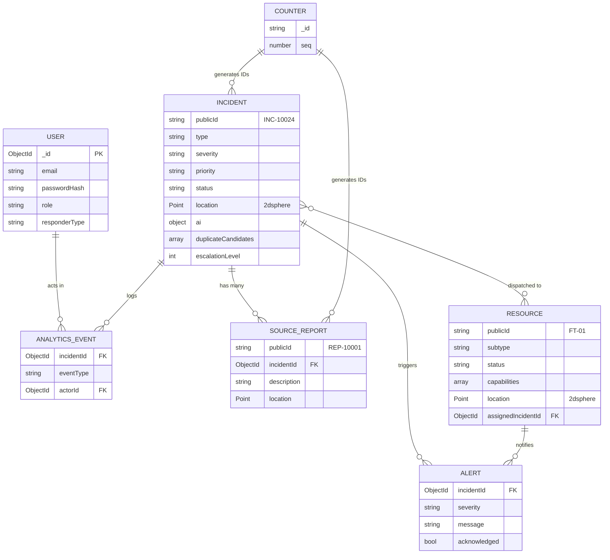

<details>
<summary><b>📚 Collections and key fields</b></summary>

| Collection | Purpose |
|---|---|
| `users` | Auth accounts and roles |
| `incidents` | Central entity with AI metadata and lifecycle |
| `sourcereports` | Immutable raw reports (many per incident) |
| `resources` | Fire teams, ambulances, police, rescue, hospitals |
| `alerts` | Escalation and info alerts |
| `analyticsevents` | Event log powering KPIs |
| `counters` | Sequential ID generator (`INC-10001`, `REP-10001`) |

**Incident**

| Field | Values / notes |
|---|---|
| `type` | fire · flood · medical · accident · industrial · structural · other |
| `severity` | low · medium · high · critical |
| `priority` | P1 · P2 · P3 · P4 |
| `status` | reported → classified → assigned → en_route → on_scene → resolved → closed, or merged |
| `ai` | classified, confidence, summary, recommendedActions, source |
| Timeline | `assignedAt`, `onSceneAt`, `resolvedAt`, `closedAt` |

**Resource**

| Field | Values / notes |
|---|---|
| `publicId` | `FT-01`, `AMB-02`, `PU-03`, `RS-01`, `HOSP-01` |
| `subtype` | fire_team · ambulance · police · rescue · hospital · shelter |
| `status` | available · assigned · en_route · on_scene · unavailable |
| `capabilities[]` | `fire_suppression`, `medical`, `hazmat`, and more |

**User:** `passwordHash` is never returned by the API. Roles: citizen · responder · operator · admin · hospital.

</details>

---

## 🔐 Security and Access Control

### Role permissions

| Capability | 🌐 Public | 👤 Citizen | 🚑 Responder | 🎛️ Operator | 🛠️ Admin |
|---|:---:|:---:|:---:|:---:|:---:|
| Submit an incident report | ✅ | ✅ | ✅ | ✅ | ✅ |
| View a single incident, resources, alerts | ❌ | ✅ | ✅ | ✅ | ✅ |
| Progress incident status, update resource status | ❌ | ❌ | ✅ | ✅ | ✅ |
| List all incidents, dispatch, merge, acknowledge alerts | ❌ | ❌ | ❌ | ✅ | ✅ |
| View analytics, run and reset demo | ❌ | ❌ | ❌ | ✅ | ✅ |
| Seed resources | ❌ | ❌ | ❌ | ❌ | ✅ |

### Safeguards

| Mechanism | Detail |
|---|---|
| **Password hashing** | `bcryptjs`, 10 rounds |
| **JWT authentication** | HS256, 7-day expiry, signed with `JWT_SECRET` |
| **Role-based access control** | `requireRole(...)` middleware on every protected route |
| **Privilege escalation blocked** | Public registration is forced to `citizen` or `responder`, so nobody can self-register as admin or operator |
| **Secret hygiene** | `passwordHash` stripped by `User.toJSON()`; all secrets in gitignored `.env`; Gemini key never reaches the browser |
| **CORS** | Restricted to `CLIENT_URL` |
| **HTTP hardening** | Helmet (CSP relaxed only for the dev socket-test page) |
| **Error handling** | Global handler maps Mongoose and API errors to consistent JSON; stack traces never leak in production |
| **Validation** | Mongoose schema level plus controller level |
| **Rate limiting** | `express-rate-limit` installed, enabled when configured |

---

## 📁 Project Structure

<details>
<summary><b>🖧 server/ — Node.js + Express + Socket.IO</b></summary>

```text
server/
├── server.js                      # Entry: env → DB → http → Socket.IO → cron
├── scripts/createAdmin.js
├── public/socket-test.html        # Debug page for Socket.IO
└── src/
    ├── app.js                     # Express app + middleware + routes
    ├── config/db.js               # MongoDB connection
    ├── controllers/               # Thin HTTP handlers
    │   ├── auth · incident · resource · alert · analytics · demo
    ├── middleware/
    │   ├── auth.js                # JWT verify + requireRole
    │   └── errorHandler.js        # Global error mapper
    ├── models/                    # Mongoose schemas (2dsphere indexes)
    │   ├── User · Incident · SourceReport · Resource
    │   └── Alert · AnalyticsEvent · Counter
    ├── routes/                    # 6 route groups
    ├── services/                  # ★ All business logic
    │   ├── ai.service.js              # Gemini + 4-model fallback
    │   ├── classification.service.js  # Rule engine
    │   ├── duplicate.service.js       # Geo + time + text scoring
    │   ├── resource.service.js        # Ranking + CRUD
    │   ├── incident.service.js        # Orchestration
    │   ├── alert.service.js
    │   ├── escalation.service.js      # node-cron
    │   └── analytics.service.js       # Aggregation pipelines
    ├── sockets/socket.js          # initSocket + safeEmit
    ├── seed/seedData.js           # Users, resources, incidents, alerts
    └── utils/                     # logger · generateId · distance · ApiError · asyncHandler · apiResponse
```

</details>

<details>
<summary><b>🖥️ client/ — React 19 + Vite</b></summary>

```text
client/
├── index.html · vite.config.js · package.json
└── src/
    ├── main.jsx · App.jsx
    ├── pages/                     # Route-level components
    │   ├── Login · CitizenReport · Dashboard · Incidents
    │   └── IncidentDetails · Resources · Alerts · Analytics · Responder
    ├── components/                # Grouped by domain
    │   ├── alerts/                # AlertFeed
    │   ├── analytics/             # ChartCard + Type / Severity / ResponseTime / ResourceUtil charts
    │   ├── common/                # Badge · Button · Card · Input · Layout · Toast
    │   │                          # ConnectionStatus · ProtectedRoute
    │   ├── dashboard/             # DemoControlPanel · KPICards
    │   ├── incidents/             # IncidentCard · IncidentDetailPanel
    │   ├── map/                   # MapView (Leaflet)
    │   ├── resources/             # RecommendationCard · ResourcePanel
    │   └── responder/             # AssignmentCard
    ├── context/AuthContext.jsx
    ├── hooks/useSocket.js
    ├── services/                  # api.js (Axios + JWT) · socket.js
    ├── styles/                    # variables · global · responsive
    └── utils/                     # formatters · leafletSetup
```

</details>

### 🌐 Frontend routes

| Route | Page | Roles |
|---|---|---|
| `/login` | Login (with demo-account quick-fill) | Public |
| `/report` | Citizen Report | Public |
| `/dashboard` | Command Center | operator, admin |
| `/incidents` | Incidents list | operator, admin |
| `/incidents/:id` | Incident details (stub, drawer covers most use) | operator, admin, responder |
| `/resources` | Resource fleet | operator, admin |
| `/alerts` | Alert feed | operator, admin |
| `/analytics` | Charts and KPIs | operator, admin |
| `/responder` | My assignments (mobile-friendly) | responder |

**State:** React Context for auth, local state elsewhere. No Redux, because the scale does not justify it. Axios injects the JWT and auto-logs-out on `401`.

---

## 🚀 Quick Start

**Prerequisites:** Node.js v18+ · npm v9+ · a free MongoDB Atlas cluster · a Gemini API key from [Google AI Studio](https://aistudio.google.com/app/apikey)

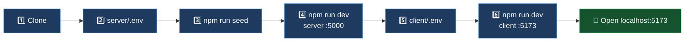

### 1. Clone

```bash
git clone https://github.com/<your-username>/PS-9.git
cd PS-9
```

### 2. Backend

```bash
cd server
npm install
```

Create `server/.env`:

```env
PORT=5000
MONGODB_URI=            # MongoDB Atlas connection string
JWT_SECRET=             # any long random string
GEMINI_API_KEY=         # from aistudio.google.com/app/apikey
CLIENT_URL=http://localhost:5173
NODE_ENV=development

# Escalation thresholds (minutes)
ESCALATION_ENABLED=true
ESCALATION_P1_WARNING=2
ESCALATION_P1_CRITICAL=5
ESCALATION_P2_WARNING=5
ESCALATION_P2_CRITICAL=10
ESCALATION_P3_WARNING=15
ESCALATION_P3_CRITICAL=30
ESCALATION_P4_WARNING=30
ESCALATION_P4_CRITICAL=60
```

```bash
npm run seed     # 6 users · 19 resources · sample incidents and alerts
npm run dev      # → http://localhost:5000
```

### 3. Frontend

In a new terminal:

```bash
cd client
npm install
```

Create `client/.env`:

```env
VITE_API_URL=http://localhost:5000/api/v1
VITE_SOCKET_URL=http://localhost:5000
```

```bash
npm run dev      # → http://localhost:5173
```

### 🔑 Demo accounts

Open the login page and use the **quick-fill demo account buttons** (Operator, Responder, and more). Seeded responder: `responder1@ps9.local` / `password123`.

> All demo data (incidents, resources, users) is synthetic. Coordinates are centred on Ahmedabad.

---

## 🎯 Recommended Demo Flow

**Duration: 2 to 3 minutes · only working features.** Use three browser tabs: operator, citizen and responder.

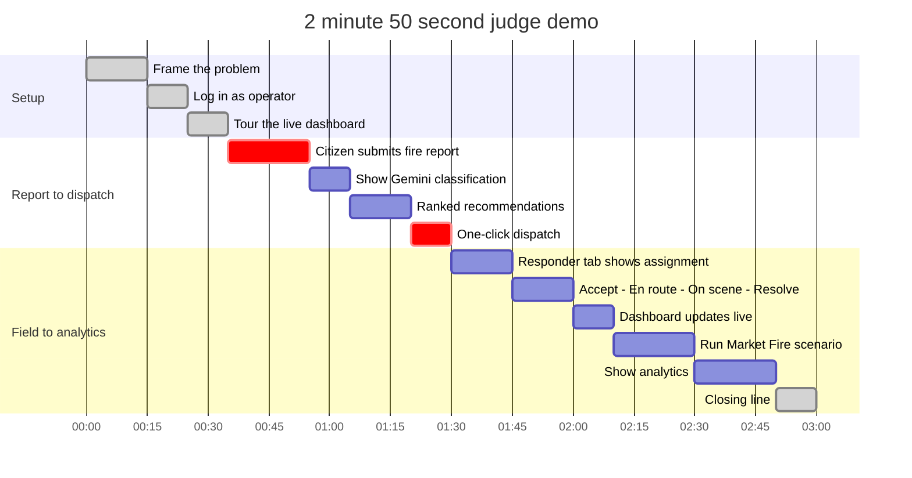

| Time | Step | What to say |
|---|---|---|
| 0:00 | Show the problem | "During emergencies, reports come from everywhere, but they never get coordinated." |
| 0:15 | Log in as operator | "This is our command center." |
| 0:25 | Show dashboard | "Live map, incidents, resources, alerts, all updating in real time." |
| 0:35 | Submit a citizen report | "Let me have a citizen report a fire." |
| 0:55 | Show AI classification | "Gemini classified it as P1 critical, with confidence and recommended actions." |
| 1:05 | Click the incident | "Recommended resources, ranked by capability, availability and distance." |
| 1:20 | Dispatch | "One click dispatches the top fire team." |
| 1:30 | Switch to responder tab | "In the field, the responder sees the assignment live." |
| 1:45 | Progress through statuses | "Accept, En Route, On Scene, Resolve. Every change broadcasts." |
| 2:00 | Back to dashboard | "The operator view updated without a refresh." |
| 2:10 | Run Market Fire | "We built a one-click demo of the entire lifecycle." |
| 2:30 | Show analytics | "All of this feeds real-time analytics." |
| 2:50 | Close | "PS-9 turns fragmented reports into coordinated response." |

### 🔥 The one-click "Market Fire" scenario

`POST /api/v1/demo/market-fire` responds immediately, then runs a scripted lifecycle **through the real services and real Socket.IO broadcasts**. Nothing is faked on the front end.

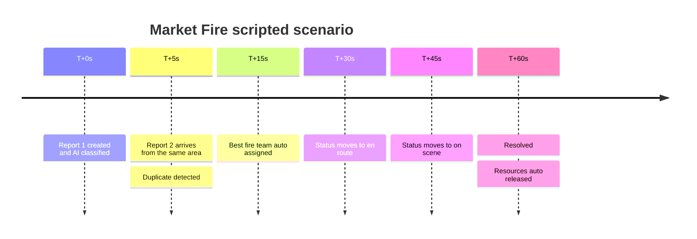

---

## 💪 What Makes It Technically Strong

Implementation details, not marketing:

| # | Highlight | Detail |
|:---:|---|---|
| 1 | **Multi-signal duplicate detection** | `$near` (300 m) + time window + Jaccard text similarity, weighted 40/20/40, with explainable breakdown per candidate |
| 2 | **Resilient AI pipeline** | 4-model fallback chain plus rule classifier. Classification works whether Gemini is up, slow or down |
| 3 | **Deterministic recommendation** | Capability 50% + availability 25% + distance 25%, with ETA estimation. Explainable and debuggable |
| 4 | **State machine with validation** | Lifecycle enforced server-side. Invalid transitions return HTTP 400 |
| 5 | **Real-time event bus** | 9 Socket.IO event types drive every live view |
| 6 | **Database-level geospatial indexing** | `2dsphere` on incidents and resources, so `$near` scales with MongoDB |
| 7 | **Idempotent cron escalation** | Priority-based thresholds, never fires the same level twice, skips incidents with assigned resources |
| 8 | **Aggregation-pipeline analytics** | 8 endpoints, including hotspot clustering on rounded grid coordinates |
| 9 | **Sequential public IDs** | Counter collection gives restart-safe `INC-10001` and `REP-10001` |
| 10 | **Role-based access control** | 5 roles with route-level and controller-level enforcement |
| 11 | **Configuration by environment** | AI model, escalation thresholds and secrets, with nothing hardcoded |
| 12 | **Demo through real services** | Market Fire uses production code paths end to end |

---

## ✅ Implementation Status

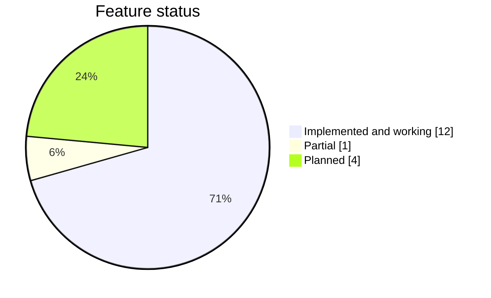

| Module | Status | Details |
|---|:---:|---|
| **Frontend** | ✅ Done | 9 routes, live map, detail drawer, charts |
| **Backend** | ✅ Done | Express with 6 route groups and health endpoints |
| **Database** | ✅ Done | MongoDB Atlas, 7 models, geo indexes |
| **Authentication** | ✅ Done | JWT + bcrypt + roles |
| **AI Classification** | ✅ Done | Gemini + 4-model fallback + rules |
| **Duplicate Detection** | ✅ Done | Geo + time + text scoring |
| **Resource Recommendation** | ✅ Done | Weighted scoring with ETA |
| **Real-Time (Socket.IO)** | ✅ Done | 9 event types, live dashboard |
| **Escalation** | ✅ Done | node-cron, priority thresholds, dedup |
| **Analytics** | ✅ Done | 8 aggregation endpoints + Recharts |
| **Seed Data** | ✅ Done | 6 users, 19 resources, incidents, alerts |
| **Demo Mode** | ✅ Done | One-click Market Fire + Reset |
| **Incident Details Page** | 🟡 Partial | Route exists, drawer covers most use |
| **Image Upload** | 🔵 Planned | Cloudinary integration |
| **OSRM Routing** | 🔵 Planned | Route overlay on map |
| **Multilingual AI** | 🔵 Planned | Hindi, Marathi, Gujarati |
| **SMS / Email notifications** | 🔵 Planned | In-app alerts only today |

---

## ⚠️ Limitations

Being upfront about what is not production-ready:

| Area | Limitation |
|---|---|
| **Free-tier services** | Render may spin down; Atlas free tier has caps; Gemini free tier has rate limits |
| **Notifications** | In-app only, with no SMS or email |
| **Attachments** | Schema field exists, but there is no upload flow yet |
| **Routing** | Distance and ETA are estimated, not routed (no OSRM overlay yet) |
| **Scale** | Tuned for 5 to 20 concurrent users, not thousands |
| **AI role** | Advisory only. The system never auto-dispatches from AI output |
| **Data** | Fully synthetic, with Ahmedabad as a fictional centre |
| **Fallback classifier** | Heuristic, not a replacement for real emergency triage |
| **Config** | `.env` files are created manually |
| **Sessions** | No refresh-token flow. JWTs last 7 days and logout is client-side |
| **Scheduler** | Escalation cron uses UTC |

---

## 🗺️ Roadmap

```mermaid
flowchart LR
    subgraph NOW["✅ SHIPPED — MVP"]
        direction TB
        N1["Report to resolve pipeline"]
        N2["AI + rule fallback"]
        N3["Live command center"]
        N4["Escalation + analytics"]
    end
    subgraph NEXT["🔜 NEXT"]
        direction TB
        X1["Image upload via Cloudinary"]
        X2["OSRM routing overlay"]
        X3["Multilingual AI"]
        X4["SMS / email / push via Twilio and SendGrid"]
    end
    subgraph LATER["🔭 LATER"]
        direction TB
        L1["Kafka / Redis Pub-Sub event streaming"]
        L2["Vector search on incident history"]
        L3["Computer vision on photos"]
        L4["Multi-district tenancy"]
        L5["Offline-first responder app"]
    end
    NOW --> NEXT --> LATER

    classDef n fill:#14532d,stroke:#4ade80,color:#fff
    classDef x fill:#7a3b12,stroke:#f0913a,color:#fff
    classDef l fill:#4a2c6b,stroke:#a86fdf,color:#fff
    class N1,N2,N3,N4 n
    class X1,X2,X3,X4 x
    class L1,L2,L3,L4,L5 l
```

<details>
<summary><b>Full enhancement list</b></summary>

- **Event streaming** (Kafka or Redis Pub-Sub) to decouple services beyond Socket.IO
- **Vector search** on incident history to find similar past incidents via embeddings
- **Image and video attachments** via Cloudinary
- **OSRM / HERE routing** for real routes and traffic-aware ETA
- **Multi-district tenancy** with separate operator teams by zone
- **Custom ML model** trained on real incidents, replacing the rule fallback
- **Computer vision** to classify from uploaded photos
- **Voice-to-incident** using the Web Speech API
- **Multilingual AI** (Gemini is already multilingual-capable)
- **Native mobile app** for responders, with **offline-first** sync on reconnect
- **SMS, email and push** via Twilio and SendGrid
- **High-availability deployment** on Kubernetes with managed PostgreSQL/PostGIS for hot data

</details>

---

## 👥 Team and Links

| Role | Name |
|---|---|
| *Backend And API* | *Divya Prajapati* |
| *Frontend & UI/UX Testing* |*Manpreet Kaur Sandhu* |
| *Databases and AI Engine* | *Krisha Mewada* |
| Team | *Solution Sprints 🌟* |

| 🔗 Link | URL |
|---|---|
| **GitHub** | `https://github.com/Divya112-ai/RakshakAI` |
| **Live Demo** | *Will Be Added after deploying to Vercel + Render* |
| **Video Demo** | *Will Add recording link* |
| **Documentation** | This README |

### 📄 License

No license file is currently present, so treat this as a **hackathon submission with all rights reserved** unless a license is added. To open-source it, add an `MIT` `LICENSE` file.

---

<div align="center">

**Built with care for the PS-9 hackathon**

`Report` → `Classify` → `Detect` → `Dispatch` → `Track` → `Resolve` → `Analyze`

⭐ If this project helped you understand the problem, consider giving it a star.

</div>
